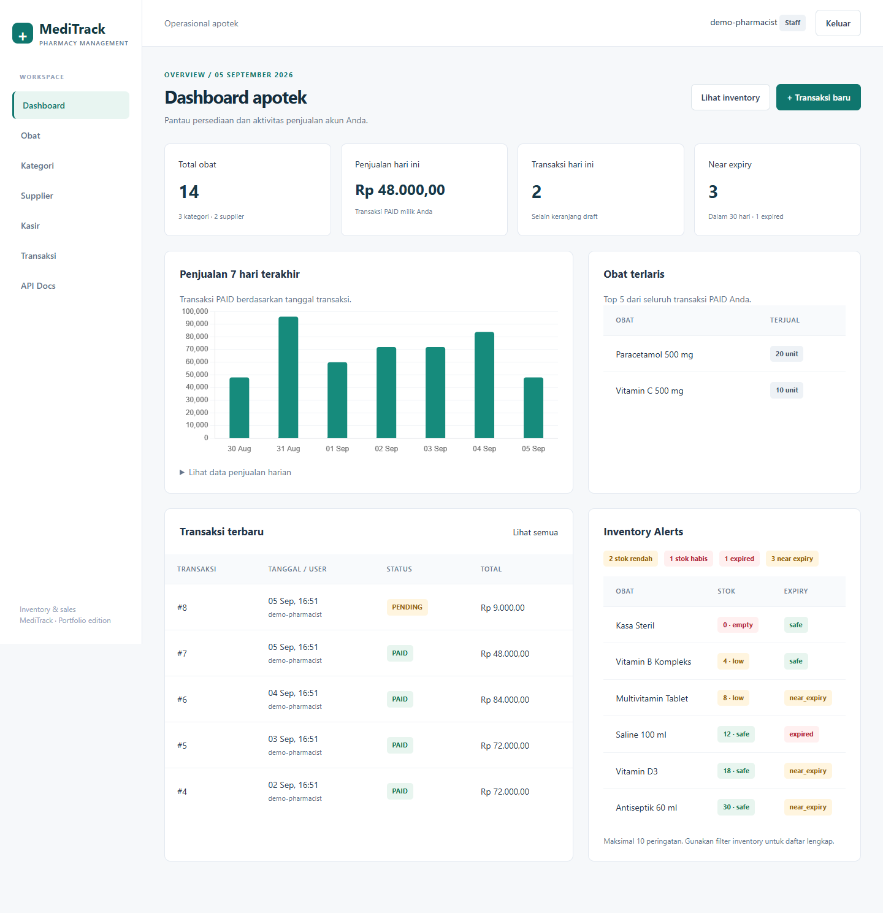

# MediTrack

Aplikasi manajemen inventory apotek dan penjualan berbasis **Django + Django REST
Framework**, dengan dashboard HTML, kasir, pelacakan expiry, audit pergerakan stok,
dan REST API berbasis Token Authentication.

Proyek portfolio akademik oleh **Fredi Irawan**, Teknik Informatika, Institut Asia
Malang. Berawal dari tugas Framework Programming dan Sistem Terdistribusi;
sekarang mencakup alur operasional apotek dari restock hingga simulasi pembayaran.
Frontend terpisah PharmaCart tidak disertakan; dashboard Django dapat dipakai
langsung. Aplikasi ini ditujukan untuk demonstrasi lokal, belum production-ready.



## Fitur

- **Inventory:** CRUD obat, kategori, supplier; search, sorting, pagination, dan
  filter stok/expiry. Harga memakai Decimal dan stok tidak boleh negatif.
- **Expiry:** tanggal opsional, status expired / near expiry / safe / unknown;
  near expiry mencakup hari ini sampai 30 hari ke depan. Obat expired ditolak
  ketika dimasukkan ke transaksi maupun saat checkout.
- **Minimum stock:** batas per obat, default 5; stok 0 berarti habis, stok positif
  sampai batas minimum berarti rendah, selebihnya aman.
- **Audit stok:** model `StockMovement` mencatat quantity, stok sebelum/sesudah,
  waktu, pengguna, referensi, dan catatan. `SALE` otomatis saat checkout/kasir,
  `IN` saat restock, `ADJUSTMENT` saat stok diedit melalui HTML, API, atau admin.
  `RETURN` tersedia sebagai tipe model; flow retur belum tersedia.
- **Kasir staff:** formset dengan penambahan baris, preview subtotal/total,
  validasi server, checkout atomic, serta detail dan simulasi pembayaran.
- **Transaksi:** `DRAFT -> PENDING -> PAID`; detail/total dihitung server,
  stok dikurangi saat checkout, seluruh perubahan di-rollback jika satu item gagal.
- **Authorization:** katalog dapat dibaca publik; management hanya staff/admin.
  Transaksi dan detail hanya dapat diakses pemilik, termasuk untuk akun staff.
- **Dashboard:** total obat, stok rendah/habis, near expiry, transaksi dan penjualan
  hari ini, chart tujuh hari, top 5 obat terjual, transaksi terbaru, inventory alerts.
- **UI:** shared base template, sidebar, menu mobile, active navigation, flash
  messages, tabel dengan scroll horizontal, halaman login dan logout POST.
- **Dokumentasi:** Swagger/OpenAPI dengan request/response custom actions;
  seed demo aman dan **83 automated tests**.

## Tech stack

| Komponen | Implementasi |
| --- | --- |
| Runtime | Python 3.11 |
| Backend | Django 4.2.7, Django REST Framework 3.14.0 |
| Database | SQLite |
| Authentication | DRF TokenAuthentication untuk API; Django session untuk HTML |
| UI | Django templates, Tailwind CSS CDN, stylesheet lokal, JavaScript ringan |
| Chart | Chart.js 4.4.7 melalui CDN; data JSON dari Django |
| API docs | drf-spectacular 0.27.1 / Swagger UI |
| Configuration | python-dotenv, environment variables |
| Tests | Django test runner, DRF APITestCase |

Dependency aplikasi tetap tercantum dalam [requirements.txt](requirements.txt).
`django-filter` dan `django-cors-headers` masih merupakan dependency awal yang
belum diaktifkan; search/ordering API menggunakan filter bawaan DRF.
Playwright yang digunakan untuk verifikasi screenshot bukan dependency runtime.
Lihat batasan versi dependency pada bagian Known Limitations sebelum deployment.

## Menjalankan aplikasi

Prasyarat: Python 3.11, pip, dan Git.

```bash
git clone https://github.com/Freddy47588/meditrack-pharmacy-management-system-django.git
cd meditrack-pharmacy-management-system-django
python -m venv .venv
```

Aktifkan virtual environment:

```powershell
# Windows PowerShell
.\.venv\Scripts\Activate.ps1
```

```bash
# macOS / Linux
source .venv/bin/activate
```

Install dependency dan salin environment:

```bash
python -m pip install -r requirements.txt
```

PowerShell: `Copy-Item .env.example .env`. macOS/Linux: `cp .env.example .env`.
Buat key pribadi, lalu simpan output dalam tanda kutip di `DJANGO_SECRET_KEY`
pada `.env` agar session bertahan setelah proses restart:

```bash
python -c "from django.core.management.utils import get_random_secret_key; print(get_random_secret_key())"
python manage.py migrate
python manage.py createsuperuser
python manage.py runserver
```

Masuk melalui [login lokal](http://127.0.0.1:8000/login/) dengan akun yang dibuat.
Dashboard: [halaman utama](http://127.0.0.1:8000/).
Staff dapat mengelola katalog, kasir, dan restock. Superuser juga dapat memberikan
flag `is_staff` melalui Django admin; tidak ada role system tambahan.

Untuk database lama, migrasi `0003` menambah field nullable/default tanpa menghapus
history. Migrasi menolak data lama dengan jumlah item nol/negatif atau harga
negatif, dengan pesan untuk memperbaikinya terlebih dahulu. Back up database
sebelum migrasi; riwayat stok sebelum upgrade tidak dibuat-buat.

## Demo data

Jalankan pada **database development kosong**:

```bash
python manage.py migrate
python manage.py seed_demo
python manage.py changepassword demo-pharmacist
python manage.py runserver
```

Seed membuat 3 kategori, 2 supplier fiktif, 14 obat dengan stok dan expiry bervariasi,
7 transaksi PAID dalam tujuh hari, 1 transaksi PENDING, serta audit stok.
Akun `demo-pharmacist` adalah staff dengan **password tidak dapat digunakan**
sampai Anda mengatur password pribadi. Tidak ada default password atau token.

Seed repeatable: jika dataset demo sudah ada, command berhenti tanpa perubahan,
tanpa reset stok atau duplikasi transaksi. Command menolak `DEBUG=false` maupun
database non-demo yang sudah berisi data. Untuk menghindari perubahan database
kerja yang sudah ada, pakai path database demo terpisah pada terminal yang sama:

```powershell
$env:DJANGO_DB_PATH = Join-Path $env:TEMP 'meditrack-demo.sqlite3'
python manage.py migrate
python manage.py seed_demo
python manage.py changepassword demo-pharmacist
python manage.py runserver
```

```bash
# macOS / Linux
export DJANGO_DB_PATH=/tmp/meditrack-demo.sqlite3
```

Untuk kembali ke database default setelah server berhenti:
`Remove-Item Env:DJANGO_DB_PATH` (PowerShell) atau `unset DJANGO_DB_PATH`.
Dataset lama tidak digeser tanggalnya saat seed diulang; gunakan database demo
baru jika ingin demo tanggal terkini. Seluruh file SQLite diabaikan Git.

## Alur penggunaan

1. Buat kategori dan supplier, lalu obat dengan harga, minimum stock dan expiry.
2. Buka detail obat untuk **Restock** atau melihat 50 pergerakan stok terakhir.
3. Buka **Kasir**, pilih obat dan jumlah. Baris kosong tambahan boleh diabaikan.
4. Klik **Checkout**. Server memeriksa harga/expiry/stok, mencatat SALE dan
   menghasilkan transaksi PENDING secara atomic.
5. Di detail transaksi, pilih **Simulasikan pembayaran** untuk menjadi PAID.
6. Lihat laporan dashboard dan daftar transaksi akun Anda.

Preview kasir adalah estimasi; harga saat checkout menjadi nilai final. Perubahan
harga katalog setelah checkout tidak mengubah subtotal atau harga satuan historis.
Transaksi PENDING/PAID tidak dapat diedit atau dihapus melalui CRUD. Penghapusan
DRAFT tidak menambah stok karena stoknya belum dikurangi. Produk yang dirujuk
history transaksi/stok, serta kategori/supplier yang masih digunakan, dilindungi
dari penghapusan. Admin melihat transaksi, detail, dan audit stok secara read-only.

## API

- [Swagger UI](http://127.0.0.1:8000/api/docs/)
- [OpenAPI schema](http://127.0.0.1:8000/api/schema/)

Kedua endpoint dokumentasi publik. Register memakai `username`, `password`,
`password2`; validasi password mengikuti validator Django. Ambil token melalui
login API, lalu gunakan header ini dengan token pribadi:

```http
Authorization: Token <your-token>
```

| Method | Endpoint | Perilaku |
| --- | --- | --- |
| POST | `/api/auth/register/` | Registrasi publik; akun biasa, bukan staff |
| POST | `/api/auth/token/` | Login token |
| GET / POST | `/api/obat/`, `/api/kategori/`, `/api/supplier/` | Baca publik / buat hanya staff |
| GET / PUT / PATCH / DELETE | `/api/{katalog}/{id}/` | Detail publik / perubahan hanya staff |
| GET / POST | `/api/transaksi/` | Daftar sendiri / buat atau gunakan draft sendiri |
| GET / PUT / PATCH / DELETE | `/api/transaksi/{id}/` | Milik sendiri; hanya DRAFT dapat diedit/dihapus |
| GET | `/api/transaksi/cart/` | Ambil atau buat keranjang sendiri |
| POST | `/api/transaksi/cart/add/` | Tambah `obat` dan `jumlah`; duplicate obat digabung |
| PATCH / DELETE | `/api/transaksi/cart/items/{item_id}/` | Ganti jumlah/obat atau hapus item DRAFT sendiri |
| POST | `/api/transaksi/cart/checkout/` | Validasi semua item, kurangi stok, status PENDING |
| POST | `/api/transaksi/{id}/pay/` | Simulasi PENDING menjadi PAID |
| GET | `/api/transaksi/my/` | Riwayat sendiri selain DRAFT |
| GET / POST | `/api/detail-transaksi/` | Detail milik sendiri / tambah pada DRAFT sendiri |
| GET / PUT / PATCH / DELETE | `/api/detail-transaksi/{id}/` | Milik sendiri; write hanya DRAFT |

Semua endpoint menggunakan trailing slash. `status`, `user`, dan total transaksi
read-only; field tersebut tidak dapat dipakai untuk melewati checkout/pay. Item
tidak dapat dipindahkan ke transaksi lain. Mengganti obat dengan obat yang sudah
ada di draft ditolak; penambahan item lewat POST menggabungkan jumlahnya.

Contoh search: `GET /api/obat/?search=paracetamol&ordering=harga`.
Contoh tambah cart:

```json
{"obat": 1, "jumlah": 2}
```

ID mengikuti database Anda. Stok tidak dipesan ketika masih DRAFT. Saat checkout,
harga dibaca kembali dan kegagalan satu item membatalkan seluruh perubahan.
API mempertahankan response list tanpa pagination untuk kompatibilitas; pagination
12 baris diterapkan pada daftar HTML. Login session HTML tidak menggantikan token API.

## Reporting semantics

Inventory bersifat global. KPI transaksi, penjualan, chart, transaksi terbaru,
dan top selling products dibatasi pada **pemilik yang login**, termasuk staff.
Penjualan hanya menghitung PAID, berdasarkan `tanggal` pembuatan transaksi dan
zona waktu aplikasi (UTC); bukan timestamp pembayaran. Top 5 mencakup seluruh
periode, chart mencakup hari ini dan enam hari sebelumnya, termasuk hari nol
penjualan. Inventory alerts dapat tumpang tindih: satu obat bisa stok rendah
sekaligus near expiry. Tabel data harian tersedia jika chart CDN tidak termuat.

## Tests dan validation

```bash
python manage.py check
python manage.py makemigrations --check
python manage.py test
python manage.py spectacular --validate --file schema.yml
```

Hasil upgrade: **83 tests passed, 0 failures, 0 errors** (baseline 42).
Cakupan mencakup model constraints, token/registration, ownership HTML/API,
cart PATCH/DELETE, duplicate item, status transitions, kasir, stock rollback,
expiry boundaries, restock, stock movements, dashboard isolation, demo safety,
pagination, CSRF, schema, dan render seluruh halaman utama.

Test runner membuat database terisolasi dan membersihkannya setelah test. Tidak
memerlukan database lokal atau server development. File schema hasil ekspor
bersifat opsional; jangan menambahkan artifact sementara yang tidak diperlukan.

Smoke test browser nyata: login, kasir, payment, menu mobile, chart, dan halaman
`/`, `/obat/`, `/kasir/`, `/transaksi/`, `/api/docs/`. Desktop 1440 px,
tablet 768 px, mobile 390 px; tidak ditemukan horizontal overflow pada halaman
utama (tabel tetap dapat di-scroll), HTTP 500, atau error JavaScript.

## Struktur penting

```text
meditrack/
  models.py                 # Catalog, transactions, stock movement
  services.py               # Shared atomic stock/cart/checkout/pay operations
  permissions.py            # Public catalog reads, staff writes
  views.py                  # HTML views and DRF viewsets
  serializers.py            # API validation and schema request types
  forms.py                  # Catalog, cashier and restock forms
  auth_api.py               # Registration and password validation
  management/commands/seed_demo.py
  migrations/               # Original migration history preserved
  templates/meditrack/       # base.html and page templates
  static/meditrack/          # Local CSS and cashier estimates
  tests/
meditrack_project/           # Settings and project routing
docs/screenshots/           # Real application captures
```

## Environment

| Variable | Default | Fungsi |
| --- | --- | --- |
| `DJANGO_DEBUG` | `true` | Environment-based debug; seed hanya untuk development |
| `DJANGO_SECRET_KEY` | Acak per proses saat DEBUG aktif | Isi key pribadi untuk session stabil; wajib saat DEBUG=false |
| `DJANGO_ALLOWED_HOSTS` | Kosong | Host dipisahkan koma; contoh localhost,127.0.0.1 |
| `DJANGO_DB_PATH` | `db.sqlite3` di root | Path SQLite alternatif, misalnya database demo terpisah |

Environment sistem mengalahkan `.env`. Contoh ada pada [.env.example](.env.example).
`.env`, database, cache, virtual environment, dan token tidak disimpan dalam Git.

## Screenshots

Lihat [galeri dan instruksi capture](docs/screenshots/README.md): dashboard,
inventory, kasir, detail transaksi, Swagger, dan dashboard mobile. Semua gambar
berasal dari aplikasi lokal dengan data fiktif; tidak ada screenshot buatan.

## Known Limitations

- **Dependency lama:** pin Django 4.2.7 berasal dari project awal. Seri 4.2 telah
  mencapai akhir extended support pada 7 April 2026
  ([pengumuman Django](https://www.djangoproject.com/weblog/2026/apr/07/security-releases/)).
  Upgrade dan audit dependency diperlukan sebelum deployment publik.
- **SQLite:** atomic rollback dan conditional stock updates mencegah stok negatif,
  tetapi SQLite tidak menyediakan row lock `select_for_update`; beban write
  bersamaan dapat menghasilkan database locked. Belum ada load/concurrency test
  lintas proses atau mekanisme retry otomatis.
- **Pembayaran dan retur:** pembayaran hanya simulasi. Belum ada gateway, refund,
  pembatalan PENDING, pelepasan stok otomatis, atau workflow RETURN.
- **Inventory sederhana:** satu expiry per obat, belum per batch/lot atau FEFO.
  Expiry kosong berarti unknown; tidak ada backfill audit untuk stok sebelum upgrade.
- **Laporan:** per akun dan tanggal pembuatan transaksi, bukan laporan akuntansi
  per waktu pembayaran atau laporan seluruh kasir.
- **Deployment:** aset Tailwind/Chart/Swagger memakai CDN; belum ada konfigurasi
  produksi lengkap, rate limiting login, expiry token, backup otomatis, atau CI.
- **Audit:** jalur aplikasi/admin mencatat perubahan stok, tetapi script SQL/ORM
  langsung di luar service dapat melewati audit. Riwayat belum tamper-evident.
- **Lisensi:** repository belum memiliki file lisensi; keputusan lisensi tetap
  berada pada pemilik proyek.

## Author

**Fredi Irawan**  
Teknik Informatika, Institut Asia Malang
