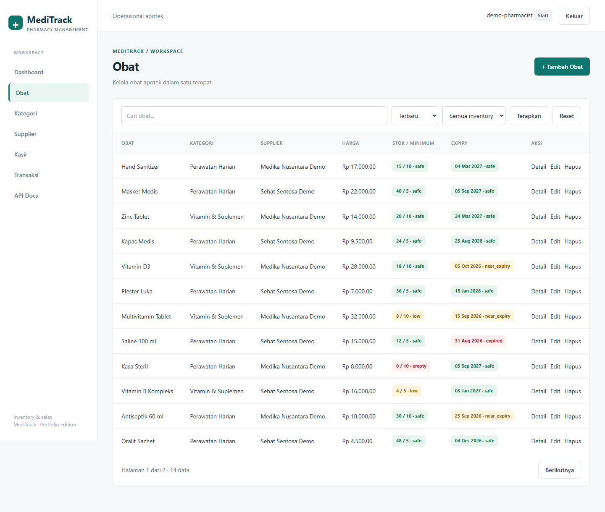
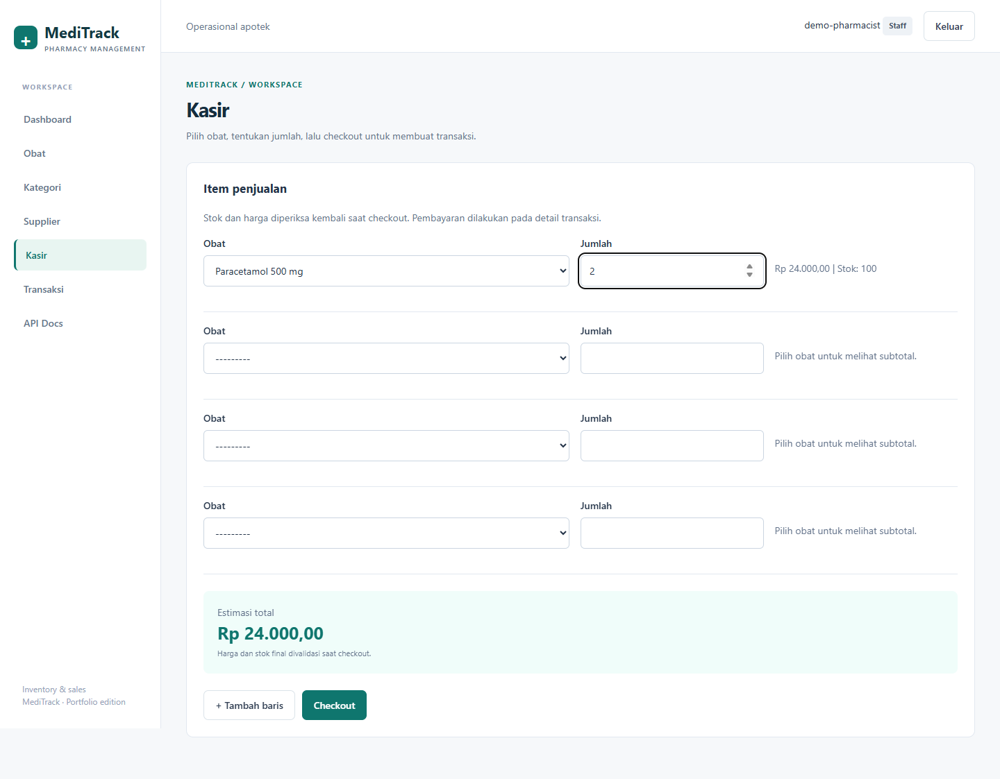
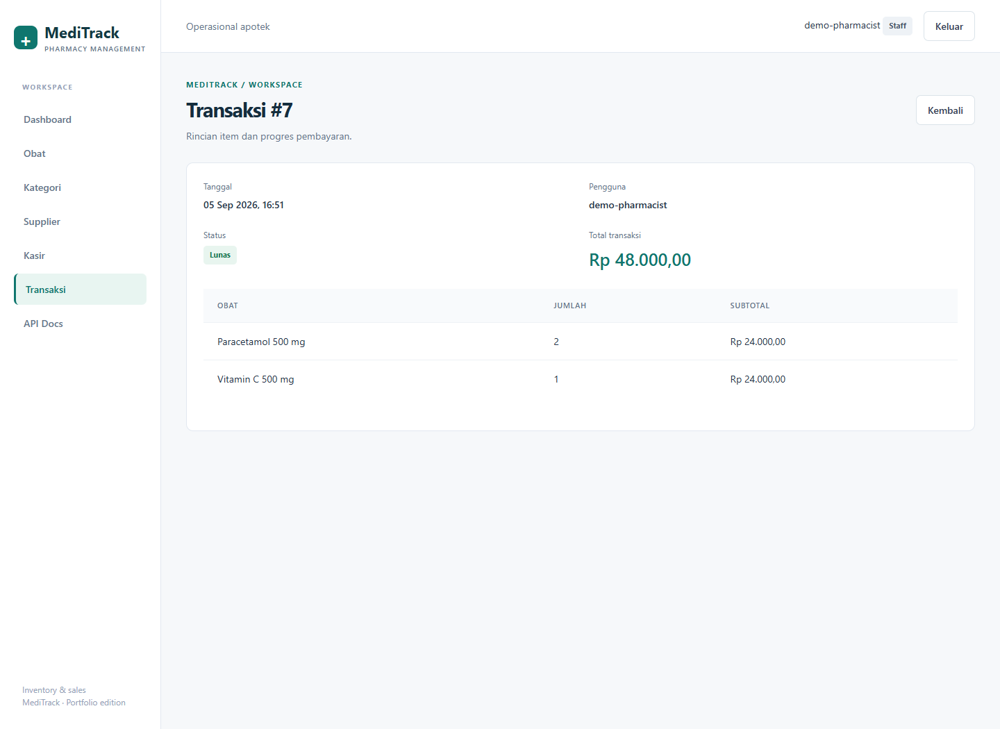
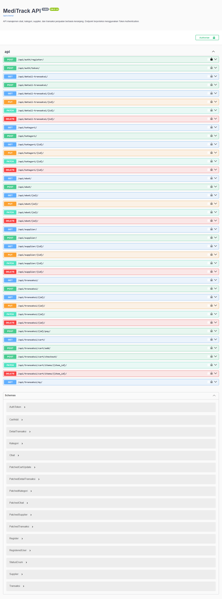
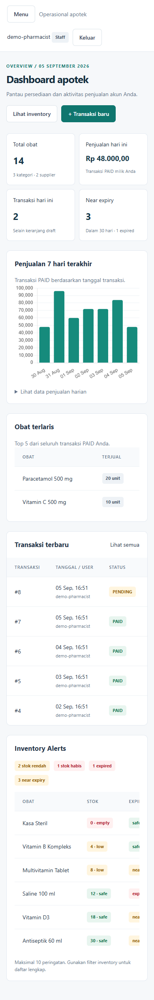

# 💊 MediTrack

> A pharmacy inventory and sales management system built with Django and Django REST Framework, from restocking to checkout and sales reporting.


Manage medicines, monitor expiry dates, and complete sales through a Django
dashboard or a token-authenticated REST API. Stock changes are recorded in an
audit trail, while each user sees their own transactions and sales metrics.

An academic portfolio project developed from Framework Programming and
Distributed Systems coursework. The Django interface runs on its own; the
separate PharmaCart frontend is not included. Intended for local demonstrations;
see [Known Limitations](#known-limitations) for deployment considerations.

[Features](#features) · [Screenshots](#screenshots) · [Getting Started](#getting-started) · [Demo Data](#demo-data) · [REST API](#rest-api) · [Testing](#testing)

<a id="features"></a>

## ✨ Features

- **Medicine inventory:** manage medicines, categories, and suppliers; search,
  sort, and browse paginated HTML lists with stock and expiry filters.
- **Expiry tracking:** identify expired, near-expiry, safe, or unknown dates.
  Near expiry includes today through the next 30 days; expired medicines are
  rejected when adding items and at checkout.
- **Minimum stock:** set a threshold per medicine (default: 5). Zero stock is
  empty; positive stock at or below the threshold is low.
- **Stock audit and restocking:** `StockMovement` records quantities, before/after
  balances, timestamps, users, references, and notes. Restocking records `IN`,
  checkout records `SALE`, and HTML/API/admin stock edits record `ADJUSTMENT`.
- **Staff cashier/POS:** add multiple items, preview totals, and complete an atomic
  checkout with server-side validation and a simulated payment step.
- **Transaction lifecycle:** `DRAFT → PENDING → PAID`, with Decimal prices,
  server-calculated totals, stock deduction at checkout, and rollback if any item fails.
- **Authorization:** public catalog reads, staff-only management actions, and
  transaction access restricted to the owner, including for staff accounts.
- **Sales dashboard:** daily sales and transaction counts, a seven-day chart,
  top five products, recent transactions, and inventory alerts.
- **Responsive interface:** shared navigation, a mobile menu, scrollable tables,
  login, POST-only logout, and feedback messages.
- **Developer tooling:** REST API, Swagger/OpenAPI, a repeatable demo seed command,
  and 83 automated tests.

## 🧰 Tech Stack

| Component | Implementation |
| --- | --- |
| Runtime | Python 3.11 |
| Backend | Django 4.2.7, Django REST Framework 3.14.0 |
| Database | SQLite |
| Authentication | DRF TokenAuthentication for the API; Django sessions for HTML |
| Interface | Django templates, Tailwind CSS via CDN, local CSS, lightweight JavaScript |
| Charts | Chart.js 4.4.7 via CDN, with JSON data from Django |
| API documentation | drf-spectacular 0.27.1, Swagger UI |
| Configuration | python-dotenv, environment variables |
| Testing | Django test runner, DRF APITestCase |

Dependencies are pinned in [requirements.txt](requirements.txt).
`django-filter` and `django-cors-headers` are retained dependencies but are not
enabled; API search and ordering use DRF's built-in filters. Playwright was used
for screenshot verification and is not a runtime dependency.

<a id="screenshots"></a>

## 📸 Screenshots

Real application captures using fictional demo data. The interface currently
uses Indonesian labels; the documentation describes the same workflows in English.

| Dashboard | Inventory |
| --- | --- |
|  |  |

| Cashier / POS | Transaction Detail |
| --- | --- |
|  |  |

| API Documentation | Mobile Dashboard |
| --- | --- |
|  |  |

See [screenshot notes](docs/screenshots/README.md) for capture details. Dates and
values reflect the demo at capture time.

<a id="getting-started"></a>

## 🚀 Getting Started

Prerequisites: **Python 3.11**, pip, and Git.

```bash
git clone https://github.com/Freddy47588/meditrack-pharmacy-management-system-django.git
cd meditrack-pharmacy-management-system-django
python -m venv .venv
```

Activate the virtual environment:

Windows PowerShell:

```powershell
.\.venv\Scripts\Activate.ps1
```

macOS / Linux:

```bash
source .venv/bin/activate
```

Install dependencies:

```bash
python -m pip install -r requirements.txt
```

Copy [.env.example](.env.example) to `.env` using `Copy-Item .env.example .env`
(PowerShell) or `cp .env.example .env` (macOS/Linux). Generate a private key and
save the output in quotes as `DJANGO_SECRET_KEY` in `.env` to keep sessions valid
across restarts:

```bash
python -c "from django.core.management.utils import get_random_secret_key; print(get_random_secret_key())"
```

For a populated walkthrough, follow [Demo Data](#demo-data) **before creating a
superuser**: the seed command requires an empty database, including user accounts.
For a manual setup, continue with:

```bash
python manage.py migrate
python manage.py createsuperuser
python manage.py runserver
```

Open the [dashboard](http://127.0.0.1:8000/) and
[sign in](http://127.0.0.1:8000/login/) with your new account. Staff can manage
the catalog, restock, and use the cashier. A superuser can grant `is_staff` through
[Django admin](http://127.0.0.1:8000/admin/); there is no additional role system.

For an existing database, back it up before migrating. Migration `0003` preserves
history and adds nullable/default fields, but stops if legacy data has nonpositive
item quantities or negative prices. Correct those records before retrying. Earlier
stock movements are not backfilled.

<a id="demo-data"></a>

## 🌱 Demo Data

Use an **empty development/demo database**. To keep the demo separate, set
`DJANGO_DB_PATH` in the same terminal before running the commands below.

Windows PowerShell:

```powershell
$env:DJANGO_DB_PATH = Join-Path $env:TEMP 'meditrack-demo.sqlite3'
```

macOS / Linux:

```bash
export DJANGO_DB_PATH=/tmp/meditrack-demo.sqlite3
```

Then, on either platform:

```bash
python manage.py migrate
python manage.py seed_demo
python manage.py changepassword demo-pharmacist
python manage.py runserver
```

Sign in as `demo-pharmacist` with the password you set. The seed creates
**3 categories, 2 fictional suppliers, 14 medicines, 7 paid transactions across
seven days, 1 pending transaction, and stock audit records**.

- **No default credentials:** the demo staff account has an unusable password
  until you set one. No token is created.
- **Repeatable:** if the demo account already exists, the command exits without
  changing records, resetting stock, or duplicating transactions.
- **Development only:** the command refuses `DJANGO_DEBUG=false` and rejects
  existing non-demo data, including user accounts.
- **Fixed dates:** rerunning does not refresh the dataset's dates. Use a new,
  empty demo database for a walkthrough with current dates.

After stopping the server, restore the default database selection with
`Remove-Item Env:DJANGO_DB_PATH` (PowerShell) or `unset DJANGO_DB_PATH`
(macOS/Linux). SQLite database files are ignored by Git.

## 🧭 Usage Flow

1. As staff, create categories and suppliers, then add medicines with prices,
   stock thresholds, and optional expiry dates.
2. Open a medicine's detail page to restock or inspect its latest 50 stock movements.
3. Open the cashier at `/kasir/`, select medicines, and enter quantities. Extra
   empty rows can be left blank.
4. Check out. The server checks stock and expiry, recalculates prices, records
   `SALE` movements, and creates a `PENDING` transaction atomically.
5. Use the simulated payment action on the transaction detail page to mark it `PAID`.
6. Review your transactions and dashboard metrics.

Cashier previews are estimates; checkout prices are final. Later catalog price
changes do not alter historical subtotals or unit prices. `PENDING` and `PAID`
transactions cannot be edited or deleted through CRUD. Deleting a `DRAFT` does
not restore stock because drafts do not reserve it.

Medicines referenced by transaction or stock history, and categories/suppliers
still in use, are protected from deletion. Transactions, line items, and stock
movements are read-only in Django admin.

<a id="rest-api"></a>

## 🔌 REST API

With the local server running:

- [Swagger UI](http://127.0.0.1:8000/api/docs/) — interactive endpoint documentation.
- [OpenAPI schema](http://127.0.0.1:8000/api/schema/) — machine-readable API definition.

Both documentation endpoints are public. Register with `username`, `password`,
and `password2`; passwords are checked against Django's validators. Obtain a token
by posting `username` and `password` to `/api/auth/token/`, then send:

```http
Authorization: Token <your-token>
```

HTML session login does not authenticate API requests. Internal field names and
endpoint paths retain their original identifiers: `obat` means medicine,
`kategori` means category, and `transaksi` means transaction.

| Method | Endpoint | Behavior |
| --- | --- | --- |
| POST | `/api/auth/register/` | Public registration; creates a non-staff account |
| POST | `/api/auth/token/` | Exchange credentials for a token |
| GET / POST | `/api/obat/`, `/api/kategori/`, `/api/supplier/` | Public lists; staff-only creation |
| GET / PUT / PATCH / DELETE | `/api/obat/{id}/`, `/api/kategori/{id}/`, `/api/supplier/{id}/` | Public detail; staff-only changes |
| GET / POST | `/api/transaksi/` | List your transactions; create or reuse your draft |
| GET / PUT / PATCH / DELETE | `/api/transaksi/{id}/` | Owner only; only drafts allow updates/deletion |
| GET | `/api/transaksi/cart/` | Get or create your draft cart |
| POST | `/api/transaksi/cart/add/` | Add `obat` and `jumlah`; repeated medicines merge quantities |
| PATCH / DELETE | `/api/transaksi/cart/items/{item_id}/` | Update medicine/quantity or remove an item from your draft |
| POST | `/api/transaksi/cart/checkout/` | Validate all items, deduct stock, and move to `PENDING` |
| POST | `/api/transaksi/{id}/pay/` | Simulate payment: `PENDING` to `PAID` |
| GET | `/api/transaksi/my/` | Your transaction history, excluding drafts |
| GET / POST | `/api/detail-transaksi/` | List your line items; add items to your draft |
| GET / PUT / PATCH / DELETE | `/api/detail-transaksi/{id}/` | Owner only; writes require a draft |

All endpoints use a trailing slash. Transaction `status`, `user`, and
`total_harga` are read-only, so updates cannot bypass checkout or payment.
Line items cannot be transferred to another transaction. Changing an item's
medicine to one already in the draft is rejected; POST additions merge quantities.

Search and sort medicines with `GET /api/obat/?search=paracetamol&ordering=harga`.
To add a cart item, POST to `/api/transaksi/cart/add/`:

```json
{"obat": 1, "jumlah": 2}
```

Use a medicine ID from your database; `jumlah` is the quantity. Drafts do not
reserve stock. Checkout rechecks current prices, expiry, and stock; a failure
rolls back the whole operation. API lists remain unpaginated for compatibility;
HTML lists use 12 rows per page.

## 📊 Reporting

Inventory is shared across accounts. Transaction counts, sales, charts, recent
transactions, and top products are restricted to the **signed-in owner**, including staff.

| Metric | Definition |
| --- | --- |
| Today's transactions | Your non-draft transactions created today |
| Sales totals | Your `PAID` transactions, grouped by creation date (`tanggal`) in UTC, not payment time |
| Sales chart | Today and the previous six days, including days with zero sales |
| Top five products | Quantity sold across all your paid transactions |
| Inventory alerts | Shared low/empty stock and near-expiry/expired medicines; conditions may overlap |

A daily sales table remains available if the chart CDN cannot load.

<a id="testing"></a>

## 🧪 Testing

The project includes **83 automated tests**. Latest local validation:
**83 passed, 0 failures, 0 errors**.

- Model constraints, registration, token authentication, and HTML/API ownership.
- Cart updates/deletion, duplicate items, transaction transitions, cashier flow,
  and atomic stock rollback.
- Expiry boundaries, restocking, stock audit records, and historical prices.
- Dashboard isolation, demo seed safety, pagination, CSRF, OpenAPI schema,
  and main-page rendering.

```bash
python manage.py check
python manage.py makemigrations --check
python manage.py test
python manage.py spectacular --validate --file schema.yml
```

The test runner creates and removes an isolated test database; no running
development server or populated local database is needed. `schema.yml` is an
optional generated artifact and does not need to be committed.

Existing [screenshot verification notes](docs/screenshots/README.md) document
browser checks at desktop (1440 px), tablet (768 px), and mobile (390 px) widths.

## 🏗️ Project Structure

```text
meditrack/
  models.py                 # Catalog, transactions, and stock movements
  services.py               # Shared atomic stock, cart, checkout, and payment operations
  permissions.py            # Public catalog reads and staff-only writes
  views.py                  # HTML views and DRF viewsets
  serializers.py            # API validation and schema request types
  forms.py                  # Catalog, cashier, and restock forms
  auth_api.py               # Registration and password validation
  management/commands/seed_demo.py
  migrations/               # Database migration history
  templates/meditrack/       # Shared layout and application pages
  static/meditrack/          # Local CSS and cashier estimates
  tests/                    # Automated test suite
meditrack_project/           # Project settings and routing
docs/screenshots/           # Real application captures
manage.py                   # Django management entry point
requirements.txt            # Pinned dependencies
README.md
```

## ⚙️ Environment Variables

| Variable | Default | Purpose |
| --- | --- | --- |
| `DJANGO_DEBUG` | `true` | Development debug mode; required by the demo seed |
| `DJANGO_SECRET_KEY` | Random per process when debug is enabled | Set a private key for stable sessions; required when `DJANGO_DEBUG=false` |
| `DJANGO_ALLOWED_HOSTS` | Empty | Comma-separated hosts, e.g. `localhost,127.0.0.1` |
| `DJANGO_DB_PATH` | `db.sqlite3` in the project root | Alternate SQLite path, such as a separate demo database |

System environment variables take precedence over `.env`. See
[.env.example](.env.example) for local configuration. Keep private keys and tokens
out of version control; `.env`, SQLite databases, caches, and virtual environments
are ignored by Git.

<a id="known-limitations"></a>

## ⚠️ Known Limitations

- **Outdated dependencies:** Django is pinned to 4.2.7. The 4.2 series reached the
  end of extended support on April 7, 2026, as documented in the
  [Django announcement](https://www.djangoproject.com/weblog/2026/apr/07/security-releases/).
  Dependency upgrades and an audit are needed before public deployment.
- **SQLite concurrency:** atomic rollback and conditional stock updates prevent
  negative stock, but SQLite does not provide `select_for_update` row locks.
  Concurrent writes can produce database-lock errors. There are no cross-process
  load/concurrency tests or automatic retries.
- **Simulated payments:** no payment gateway, refunds, pending-order cancellation,
  or automatic stock release. `RETURN` exists as a stock movement type, but has
  no operational workflow.
- **Simplified inventory:** one expiry date per medicine; no batch/lot tracking
  or first-expiry-first-out allocation. Missing expiry dates are unknown, and
  stock history from before the inventory upgrade is not backfilled.
- **Reporting scope:** per-account reports use transaction creation dates;
  there is no consolidated cashier report or payment-time accounting report.
- **Deployment:** Tailwind, Chart.js, and Swagger assets depend on CDNs. Full
  production configuration, login rate limiting, token expiry, automated backups,
  and CI are not included.
- **Audit boundaries:** application/admin stock changes are recorded, but direct
  SQL or ORM writes outside the services can bypass the audit. History is not
  tamper-evident.

## 📄 License

No license has been added yet.

## 👤 Author

**Fredi Irawan**  
Informatics, Asia Institute of Malang
